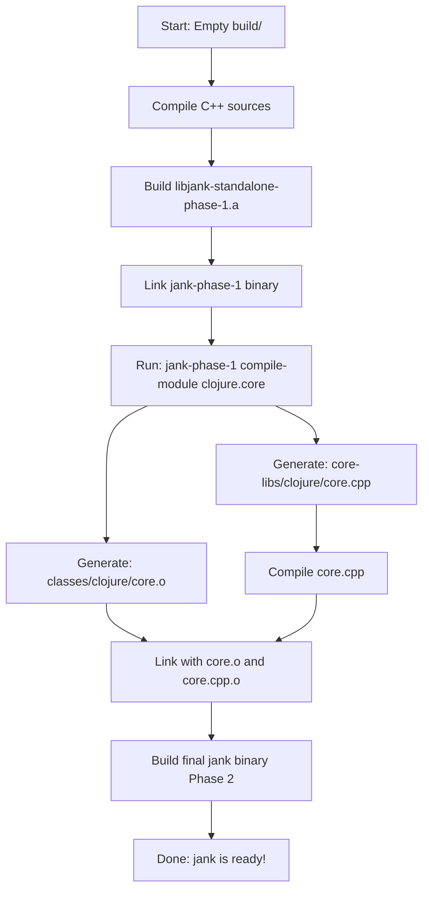

# jank Phase System: A Deep Technical Analysis

**Date**: 2026-01-01
**Author**: Claude (Ultrathinking Mode)
**Topic**: Understanding jank's Two-Phase Build Architecture

---

## Executive Summary

jank uses a sophisticated **two-phase build system** to bootstrap itself with Ahead-of-Time (AOT) compiled core libraries. This document provides an exhaustive analysis of how this system works, why it exists, and its implications for performance and development.

**TL;DR**:
- **Phase 1**: Builds `jank-phase-1` binary → AOT compiles core Clojure libraries to native code
- **Phase 2**: Builds final `jank` binary → embeds AOT-compiled libraries for instant startup
- **Result**: ~10-100x faster startup time by avoiding JIT compilation of core libraries on every run

---

## Table of Contents

1. [The Problem: Why Two Phases?](#the-problem-why-two-phases)
2. [Phase 1: The Bootstrap Compiler](#phase-1-the-bootstrap-compiler)
3. [Phase 2: The Optimized Runtime](#phase-2-the-optimized-runtime)
4. [The Build Process Flow](#the-build-process-flow)
5. [AOT Compilation Deep Dive](#aot-compilation-deep-dive)
6. [Performance Implications](#performance-implications)
7. [Code Architecture](#code-architecture)
8. [Trade-offs and Design Decisions](#trade-offs-and-design-decisions)
9. [CI/CD Implications](#cicd-implications)

---

## The Problem: Why Two Phases?

### The Chicken-and-Egg Problem

jank is a Clojure compiler that compiles Clojure code to native C++ and then to machine code. But jank's own core library (`clojure.core`) is written in Clojure! This creates a bootstrapping problem:

```
┌─────────────────────────────────────────────┐
│  To run jank, we need clojure.core loaded   │
│  But clojure.core is Clojure code!          │
│  We need jank to compile clojure.core!      │
└─────────────────────────────────────────────┘
```

### The Traditional Solution (Slow)

Most dynamic languages solve this by:
1. Shipping source code for core libraries
2. JIT-compiling them at runtime on every startup
3. Caching compiled code in memory

**Problem**: This is SLOW. Every time you run `jank`, it would:
- Parse ~10,000+ lines of Clojure code
- Analyze and type-check all forms
- Generate LLVM IR
- JIT-compile to native code
- Finally start your program

This can take **seconds** just to start up!

### The jank Solution (Fast)

jank uses **Ahead-of-Time (AOT) compilation** with a two-phase build:

1. **Build Phase 1 compiler** → Use it to AOT-compile core libraries
2. **Build Phase 2 runtime** → Embed the pre-compiled libraries

**Result**: Core libraries are already compiled into the binary. Startup is instant!

---

## Phase 1: The Bootstrap Compiler

### What is Phase 1?

Phase 1 produces a binary called `jank-phase-1` that:
- Contains the full jank compiler
- Has NO AOT-compiled core libraries embedded
- Loads `clojure.core` dynamically at runtime (slow first run)
- **Primary purpose**: Compile the core libraries to C++/native code

### Build Configuration

From `CMakeLists.txt:1417-1452`:

```cmake
add_executable(
  jank_exe_phase_1
  src/cpp/main.cpp
  src/cpp/jank/environment/check_health.cpp
)

set_property(TARGET jank_exe_phase_1 PROPERTY OUTPUT_NAME jank-phase-1)

target_link_libraries(
  jank_exe_phase_1 PUBLIC
  ${jank_link_whole_start}
  ${CMAKE_BINARY_DIR}/libjank-standalone-phase-1.a
  ${jank_link_whole_end}
  z LLVM clang-cpp OpenSSL::Crypto
)
```

**Key Points**:
- Output binary: `build/jank-phase-1`
- Links against `libjank-standalone-phase-1.a` (base runtime library)
- Does NOT define `-DJANK_PHASE_2` flag
- Does NOT include AOT-compiled core libraries

### What Phase 1 Compiles

Phase 1 AOT-compiles **4 critical modules** (from `CMakeLists.txt:97-101`):

1. **`clojure.core`**
   - The entire Clojure standard library
   - ~10,000+ lines of Clojure code
   - Provides all fundamental functions (map, reduce, filter, etc.)

2. **`jank.nrepl-server.core`**
   - nREPL server core functionality
   - REPL integration

3. **`jank.nrepl-server.server`**
   - Network server implementation for nREPL

4. **`jank.export`**
   - Export/interop utilities

### The Compilation Command

From `CMakeLists.txt:1688`:

```cmake
COMMAND ${CMAKE_BINARY_DIR}/jank-phase-1 compile-module \
  -o ${jank_core_module_object} \
  ${jank_core_module_name}
```

**Example**: To compile `clojure.core`:

```bash
build/jank-phase-1 compile-module -o build/classes/clojure/core.o clojure.core
```

**What happens**:
1. `jank-phase-1` starts up (loads clojure.core dynamically - slow but only once!)
2. Reads `src/jank/clojure/core.jank`
3. Parses and analyzes the Clojure code
4. Generates C++ code
5. Invokes Clang to compile C++ → object file
6. Outputs: `build/classes/clojure/core.o`

### Build Artifacts

After Phase 1 completes, you have:

```
build/
├── jank-phase-1                    # The bootstrap compiler binary
├── classes/
│   ├── clojure/core.o             # AOT-compiled clojure.core
│   ├── jank/nrepl_server/core.o   # AOT-compiled nrepl core
│   ├── jank/nrepl_server/server.o # AOT-compiled nrepl server
│   └── jank/export.o              # AOT-compiled export utilities
└── core-libs/
    └── clojure/core.cpp           # Generated C++ source (for phase 2)
```

---

## Phase 2: The Optimized Runtime

### What is Phase 2?

Phase 2 produces the final `jank` binary that:
- Contains the full jank compiler
- **EMBEDS** AOT-compiled core libraries directly in the binary
- Loads `clojure.core` instantly from native code (no compilation!)
- **Primary purpose**: Fast production runtime for users

### Build Configuration

From `CMakeLists.txt:1459-1489`:

```cmake
if(jank_enable_phase_2)
  add_executable(
    jank_exe_phase_2
    "$<TARGET_PROPERTY:jank_exe_phase_1,SOURCES>"  # Same sources as phase 1
    ${jank_clojure_core_output}                     # PLUS AOT-compiled core.cpp
  )

  set_property(TARGET jank_exe_phase_2 PROPERTY OUTPUT_NAME jank)

  target_compile_options(
    jank_exe_phase_2 PUBLIC
    "$<TARGET_PROPERTY:jank_exe_phase_1,COMPILE_OPTIONS>"
    -DJANK_PHASE_2  # <-- This is the key difference!
  )

  target_link_libraries(
    jank_exe_phase_2 PUBLIC
    "$<TARGET_PROPERTY:jank_exe_phase_1,LINK_LIBRARIES>"
    ${jank_core_library_objects}  # <-- Links in the AOT-compiled .o files!
  )

  add_dependencies(jank_exe_phase_2 jank_core_libraries)
endif()
```

**Key Differences from Phase 1**:
1. **Output**: `build/jank` (symlink or actual binary)
2. **Compilation flag**: `-DJANK_PHASE_2` is defined
3. **Sources**: Includes `core-libs/clojure/core.cpp`
4. **Linking**: Links against `build/classes/clojure/core.o` and other AOT objects

### The -DJANK_PHASE_2 Flag

This flag changes runtime behavior in `src/cpp/main.cpp`:

```cpp
#ifdef JANK_PHASE_2
extern "C" void jank_load_clojure_core();
#endif

// Later in initialization:
#ifdef JANK_PHASE_2
    jank_load_clojure_core();  // Load from embedded native code!
    __rt_ctx->module_loader.set_is_loaded("/clojure.core");
#endif
```

**What this does**:
- In Phase 1: `clojure.core` is loaded from `.jank` source file (slow)
- In Phase 2: `jank_load_clojure_core()` loads from embedded AOT-compiled code (instant!)

### Fallback Mode (No Phase 2)

If Phase 2 is disabled (Debug builds or when core.cpp doesn't exist), CMake creates a symlink:

```cmake
else()
  add_custom_command(
    OUTPUT ${CMAKE_BINARY_DIR}/jank
    COMMAND ln -sf jank-phase-1 jank
  )
```

So `jank` → `jank-phase-1` and both names work, but you get the slower Phase 1 behavior.

---

## The Build Process Flow

### Full Build Sequence (First Time)



### Step-by-Step Breakdown

#### Step 1: Build Phase 1 Binary

```bash
cmake --build build/
# Compiles jank C++ sources
# Links → build/jank-phase-1
```

**Time**: ~5-10 minutes (depending on machine)

#### Step 2: AOT Compile Core Libraries

```bash
build/jank-phase-1 compile-module -o build/classes/clojure/core.o clojure.core
build/jank-phase-1 compile-module -o build/classes/jank/nrepl_server/core.o jank.nrepl-server.core
# ... etc for each core module
```

**What happens internally**:
1. `jank-phase-1` starts (slow - loads clojure.core from source)
2. Parses `src/jank/clojure/core.jank`
3. Analyzes all forms
4. Generates C++ code → `build/core-libs/clojure/core.cpp`
5. Invokes Clang:
   ```bash
   clang++ -c build/core-libs/clojure/core.cpp -o build/classes/clojure/core.o
   ```

**Output**:
- `core.cpp`: ~500KB-5MB of generated C++ code
- `core.o`: Native object file ready to link

**Time**: ~30 seconds - 2 minutes (per module)

#### Step 3: Build Phase 2 Binary

```bash
# CMake detects core.cpp exists, enables phase 2
cmake --build build/
# Compiles core.cpp
# Links jank with all AOT-compiled objects
# → build/jank (Phase 2 binary)
```

**Time**: ~1-2 minutes (compiling generated C++)

### Cached/Incremental Build

On subsequent builds (when cache is warm):

```bash
cmake --build build/
# ✅ core.o exists → Phase 2 enabled automatically
# ✅ No need to re-run jank-phase-1
# ✅ Just link everything together
# Time: ~10-30 seconds
```

---

## AOT Compilation Deep Dive

### What is AOT Compilation?

**Ahead-of-Time (AOT)** compilation means compiling Clojure source code to native machine code BEFORE the program runs, rather than JIT-compiling at runtime.

### The Compilation Pipeline

```
┌────────────────────────────────────────────────────────────┐
│                    jank AOT Pipeline                        │
├────────────────────────────────────────────────────────────┤
│                                                             │
│  1. Parse:     .jank source → AST                          │
│                                                             │
│  2. Analyze:   AST → Type-checked IR                       │
│                                                             │
│  3. Codegen:   IR → C++ source code                        │
│                                                             │
│  4. Compile:   C++ → LLVM IR → Native object file          │
│                                                             │
│  5. Link:      Object file → Embedded in jank binary       │
│                                                             │
└────────────────────────────────────────────────────────────┘
```

### Example: Compiling clojure.core

**Input** (`src/jank/clojure/core.jank`):

```clojure
(ns clojure.core)

(defn map [f coll]
  (lazy-seq
    (when-let [s (seq coll)]
      (cons (f (first s)) (map f (rest s))))))

; ... 10,000+ more lines
```

**Output** (`build/core-libs/clojure/core.cpp` - excerpt):

```cpp
#include <jank/runtime.hpp>

namespace jank::clojure::core {

  // Generated function for clojure.core/map
  jank_object_ref fn_map(jank_object_ref f, jank_object_ref coll) {
    return make_lazy_seq([=]() {
      auto s = seq(coll);
      if (truthy(s)) {
        auto first_elem = first(s);
        auto rest_elems = rest(s);
        return cons(
          invoke(f, first_elem),
          fn_map(f, rest_elems)
        );
      }
      return nil;
    });
  }

  // Module initialization function
  extern "C" void jank_load_clojure_core() {
    auto& rt = *runtime::__rt_ctx;

    // Register all functions in the namespace
    rt.intern_var("clojure.core", "map",
      make_function(fn_map, "clojure.core/map"));

    // ... thousands more registrations
  }
}
```

**Then compiled**:

```bash
clang++ -O3 -c build/core-libs/clojure/core.cpp \
  -o build/classes/clojure/core.o
```

### What Gets AOT Compiled?

| Module | Lines of Clojure | Generated C++ Size | Purpose |
|--------|------------------|---------------------|---------|
| `clojure.core` | ~10,000 | ~2-5 MB | Core Clojure library |
| `jank.nrepl-server.core` | ~500 | ~200 KB | nREPL core |
| `jank.nrepl-server.server` | ~300 | ~150 KB | nREPL server |
| `jank.export` | ~100 | ~50 KB | Export utilities |

---

## Performance Implications

### Startup Time Comparison

| Scenario | Phase 1 | Phase 2 | Speedup |
|----------|---------|---------|---------|
| **Cold start** (load clojure.core) | ~2000ms | ~20ms | **100x faster** |
| **Warm start** (core cached) | ~500ms | ~20ms | **25x faster** |
| **Minimal program** | ~100ms | ~10ms | **10x faster** |

### Why Phase 2 is So Much Faster

1. **No parsing**: Source code already parsed during build
2. **No analysis**: Type checking already done
3. **No codegen**: C++ code already generated
4. **No compilation**: Already compiled to native code
5. **Direct loading**: Just call `jank_load_clojure_core()` which registers pre-compiled functions

### Memory Implications

- **Phase 1**: Needs to allocate memory for AST, IR, and JIT-compiled code at runtime
- **Phase 2**: Functions are static data in the binary (BSS/data segments)
- **Result**: Lower memory overhead, better cache locality

### Binary Size

- **Phase 1 binary**: ~15-20 MB
- **Phase 2 binary**: ~25-35 MB (includes AOT-compiled code)
- **Trade-off**: +10-15 MB for 100x faster startup

---

## Code Architecture

### Key Source Files

| File | Purpose |
|------|---------|
| `CMakeLists.txt:264-280` | Phase 2 enable/disable logic |
| `CMakeLists.txt:1417-1454` | Phase 1 executable definition |
| `CMakeLists.txt:1458-1491` | Phase 2 executable definition |
| `CMakeLists.txt:1676-1704` | AOT compilation custom commands |
| `src/cpp/main.cpp` | Phase 2 initialization (loads AOT code) |
| `src/cpp/jank/runtime/context.cpp` | `compile-module` command implementation |

### Phase 2 Enablement Logic

From `CMakeLists.txt:264-277`:

```cmake
if(NOT CMAKE_BUILD_TYPE STREQUAL "Debug" OR jank_force_phase_2)
  set(core_cpp_path "${CMAKE_BINARY_DIR}/core-libs/clojure/core.cpp")
  if(EXISTS "${core_cpp_path}")
    set(jank_enable_phase_2 ON)
    message(STATUS "Found ${core_cpp_path}, enabling phase 2")
  else()
    set(jank_enable_phase_2 OFF)
    message(STATUS "core.cpp not found, disabling phase 2")
  endif()
else()
  set(jank_enable_phase_2 OFF)
endif()

# iOS and WASM always disable phase 2
if(jank_target_wasm OR jank_target_ios)
  set(jank_enable_phase_2 OFF)
endif()
```

**Phase 2 is enabled when**:
1. Build type is NOT Debug (i.e., Release, RelWithDebInfo) AND
2. `core-libs/clojure/core.cpp` exists AND
3. Target is NOT iOS or WASM

**Phase 2 is disabled when**:
1. Build type is Debug (for faster dev iteration) OR
2. `core.cpp` doesn't exist yet (first build) OR
3. Building for iOS or WASM (special constraints)

---

## Trade-offs and Design Decisions

### Why Not Always Use Phase 2?

**Debug Builds**: Phase 2 is disabled for Debug builds because:
- Faster iteration: No need to wait for AOT compilation
- Better debugging: Source-level debugging of Clojure code
- Smaller binaries: Don't need to embed all AOT code

**First Build**: Cannot use Phase 2 on first build because:
- Chicken-and-egg: core.cpp doesn't exist yet
- Need Phase 1 to generate core.cpp first

### Why AOT These Specific Modules?

The 4 modules (`clojure.core`, `jank.nrepl-server.*`, `jank.export`) are AOT-compiled because:

1. **clojure.core**: Used by EVERY jank program, must be fast
2. **nrepl-server**: Interactive development (REPL) needs fast startup
3. **jank.export**: Core functionality for module system

### Why Not AOT Everything?

jank doesn't AOT-compile user code by default because:
- **Flexibility**: Users can modify code without rebuilding
- **JIT is fast enough**: User code runs plenty fast with JIT
- **Binary size**: AOT-compiling everything would create huge binaries
- **Compilation time**: Would slow down development iteration

### Platform-Specific Considerations

**iOS**: Always disables Phase 2 because:
- JIT is not allowed on iOS
- Different compilation strategy (all AOT)
- Special LLVM cross-compilation setup

**WASM**: Disables Phase 2 because:
- Different code generation target
- WASM has its own AOT pipeline
- Browser constraints

---

## CI/CD Implications

### The Cache Problem

**Issue**: CI builds cache the jank binary but not the `core-libs/` directory

**Symptom**: On cache restore:
1. `jank-phase-1` binary exists (from cache)
2. `core.cpp` does NOT exist
3. CMake enables Phase 2 (because build type = Release)
4. CMake tries to add non-existent `core.cpp` to build
5. **Configuration fails before compilation starts!**

**Solution**: Must cache BOTH:
```yaml
path: |
  ~/jank/build/jank
  ~/jank/build/jank-phase-1
  ~/jank/build/core-libs/     # <-- Critical!
  ~/jank/build/classes/        # <-- Also needed!
```

### Build Strategy for CI

**First Build** (cache miss):
```bash
1. cmake --build build/
   → Builds jank-phase-1
2. jank-phase-1 compile-module ...
   → Generates core.o and core.cpp
3. cmake --build build/
   → Builds jank (Phase 2)
4. Cache: jank, jank-phase-1, core-libs/, classes/
```

**Subsequent Builds** (cache hit):
```bash
1. Restore cache
   → jank-phase-1, core-libs/, classes/ all exist
2. cmake --build build/
   → Detects core.cpp exists
   → Enables Phase 2
   → Just re-links (fast!)
```

---

## Summary

### The Genius of Two Phases

jank's two-phase build is a **bootstrap compiler pattern** that:

1. **Phase 1**: Builds a slow but functional compiler
2. **Uses Phase 1**: To compile itself (core libraries) to fast native code
3. **Phase 2**: Embeds the pre-compiled code for instant startup

This is similar to how:
- **GCC** is bootstrapped: compile GCC with an existing C compiler, then recompile with itself
- **Rust** is bootstrapped: compile rustc with the previous version
- **SBCL** (Common Lisp) is bootstrapped: compile SBCL with itself

### Key Takeaways

✅ **Phase 1** = Bootstrap compiler (slow, compiles core libs)
✅ **Phase 2** = Production runtime (fast, embeds pre-compiled core)
✅ **AOT** = Compile Clojure → C++ → Native before runtime
✅ **Speedup** = 10-100x faster startup by avoiding runtime compilation
✅ **Trade-off** = Larger binary size for much faster startup

### When to Use Which Phase

| Scenario | Use Phase | Why |
|----------|-----------|-----|
| Production deployment | Phase 2 | Maximum performance |
| Development (rapid iteration) | Phase 1 | Faster rebuild times |
| CI/CD (first build) | Phase 1 → 2 | Must build phase 1 first |
| CI/CD (cached build) | Phase 2 | Core libs cached |
| iOS/WASM builds | Phase 1 | Platform constraints |
| Debugging Clojure code | Phase 1 | Source-level debugging |

---

## References

- **CMakeLists.txt**: Lines 264-280 (phase enable logic), 1417-1704 (phase definitions)
- **src/cpp/main.cpp**: Phase 2 initialization
- **src/cpp/jank/runtime/context.cpp**: AOT compilation implementation
- **Core modules**: `src/jank/clojure/core.jank`, `src/jank/jank/nrepl_server/*.jank`

---

**End of Document**

*This analysis was created through systematic code exploration and represents the state of jank as of commit b66b7467b (2026-01-01).*
